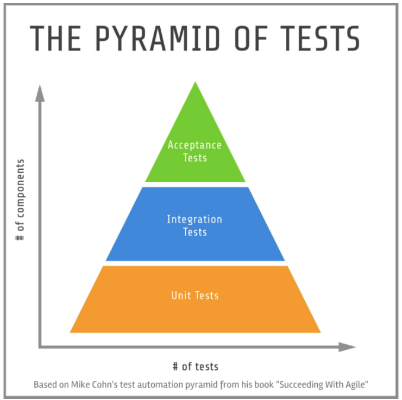

# 1. TDD란?

- **T**est **D**riven **D**evelopment: **테스트 주도 개발**을 의미
- 애플리케이션을 더 안정적으로 구현 및 운영할 수 있습니다.
  - 디버깅 시간 감소 및 생산성 증가
  - 재설계 시간 단축
  - 확장성 용이
- 이번 **TDD**는 **Node Server**에 관련해서 진행할 예정입니다.
  - Node.js 설치
    - 기존  Express Server 셋팅
  - Mongoose 설치
    - Model Class => Collection 접근
    - Model Instance => Documents 접근
    - 스키마
      - 문서의 구조, 기본값, 유효성 검사기 등을 정의
      - 스키마를 이용해서 Model을 만들 수 있습니다.
      - Model은 레코드 생성 / 쿼리 / 업데이트 / 삭제 등 데이터베이스 인터페이스를 제공합니다.
  - Jest 설치
    - 단위 테스트 모듈
  - node-mocks-http 설치
    - 단위 테스트 모듈
  - supertest 설치
    - 통합 테스트 모듈

```
npm isntall express mongoose --save

npm install jest supertest node-mocks-http --save-dev
```


### 테스트 종류

- Unit Test( 단위 테스트 )

  - 개별적인 함수들을 하나씩 테스트 하는 것
  - 의존성이 없는 개별 함수를 테스트 하는 것

- Integration Test( 통합 테스트 )

  - 여러 모듈들의 상호작용이 잘 이루어지는지 테스트 하는 것
  - 의존성을 바탕으로 한 플로우를 테스트하는 것

  



